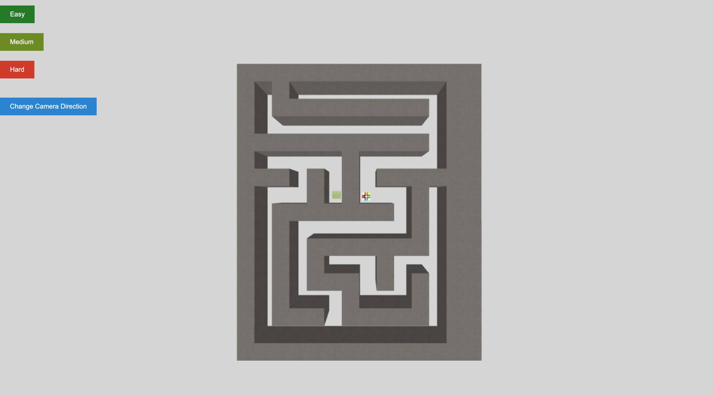

# cs460student
CS460.org at UMass Boston
github-paages: [https://upendrathota.github.io.cs460student/](https://github.com/UpendraThota/cs460student)
# 3D Maze Game

## Overview

The 3D Maze Game is an interactive 3D puzzle game built using the Three.js library. In this game, players navigate through a 3D maze, aiming to reach the goal while facing challenges and obstacles. The project serves as an academic assignment, showcasing the integration of 3D graphics, game mechanics, and user interaction.

## Features

- **3D Graphics**: Explore a visually immersive 3D environment created with Three.js.
- **Maze Generation**: Experience dynamic maze generation for unique gameplay in each session.
- **Multiple Difficulty Levels**: Choose from easy, medium, and hard difficulty levels, each with varying maze complexity.
- **User Interface**: Enjoy a user-friendly interface with options to select difficulty and change camera modes.
- **Camera Modes**: Switch between top-down, dynamic, and first-person camera modes for diverse perspectives.
- **Collision Detection**: Navigate the maze with realistic collision detection and maze interaction.

## Technologies Used

### Three.js

Three.js is a powerful JavaScript library for creating 3D graphics and interactive 3D applications in the browser. It provides a wide range of features for rendering, texturing, and animating 3D scenes. In this project, Three.js is the core technology used for creating the 3D maze environment, rendering objects, and handling user interactions.

### HTML, CSS, and JavaScript

The game's user interface and logic are built using standard web technologies, including HTML, CSS, and JavaScript. HTML is used for structuring the web page, CSS for styling, and JavaScript for implementing game mechanics and interactions.

### Textures

Textures play a crucial role in enhancing the visual appeal of the game. Various texture images are used for walls, player models, and game elements. These textures are sourced from online resources and applied to 3D objects in the scene.

## Getting Started

To run the game locally, follow these steps:

1. Clone this repository to your local machine.

2. Open the `index.html` file in a web browser.

## How to Play

- **Controls**: Use the arrow keys or "W," "A," "S," and "D" keys to move the player through the maze.
- **Objective**: Reach the goal to win the game.
- **Camera Modes**: Press "C" or click the "Change Camera Direction" button to switch between top-down, dynamic, and first-person camera modes, offering different perspectives and challenges.

## Project Structure

The project includes the following main files and directories:

- `index.html`: The main HTML file that renders the game and includes the necessary scripts and styles.
- `app.js`: The JavaScript file containing the game logic, Three.js setup, and maze generation algorithm.
- `textures/`: A directory containing texture images used for walls, player models, and game elements.
- `build/`: The directory containing the Three.js library files.

## Contributing

Contributions to the project are welcome! If you have ideas for improvements, new features, or bug fixes, feel free to open issues, submit pull requests, or suggest enhancements.

## Acknowledgments

- Special thanks to the Three.js community for creating and maintaining the Three.js library.
- Thanks to the creators of the texture images used in the game.

---

© 2023 Upendra Thota
ID: 02098600

